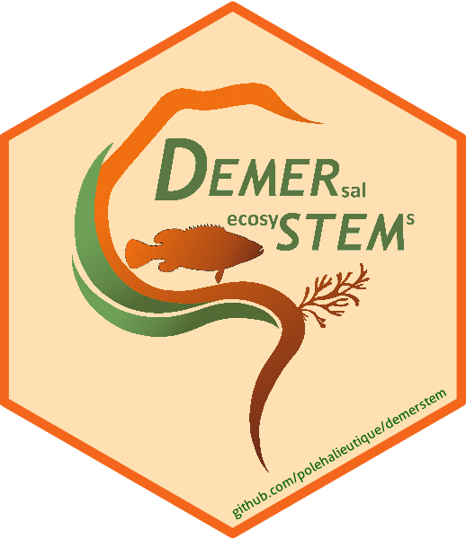

# demerstem </img>


## Overview

This package aims to provide function to help for stocks assessment process in West Africa DLS context. 
Surplus-production and length-based model are available, in particular it provides : 
1. Delta-glm method to estimate year effect and compute indices abundance
2. Surplus-production model with pseudo-equilibrium fitting
3. Polymodal decomposition to extract numbers-at-age
4. Rectified pseudo-cohort to estimate F-at-age and elaborate a diagnosis on stock status 

Ce package a été developpé durant le projet DEMERSTEM en appui à l'évaluation des stocks d'Afrique de l'Ouest en contexte data-limited.
Des modèles basés sur les tailles et de production sont disponibles. En particulier on retrouve : 
1. Une méthode d'estimation d'indices d'abondance par delta-GLM
2. Un modèle de production ajusté en pseudo-équilibre.
3. La décomposition polymodale pour estimer le nombre d'invidus de chaque âge.
4. La méthode des pseudo cohortes rectifiées pour estimer les F aux âges. 


## Installation

```r
# You need devtools to use the function install_github()
library(devtools)

# You also need to install Jags for bayesian simulation
Disponible ici : https://sourceforge.net/projects/mcmc-jags/files/JAGS/4.x/Windows/

# Vous pouvez alors installer le package 

install_github("polehalieutique/demerstem")

library(demerstem)
packageVersion("demerstem")
```
